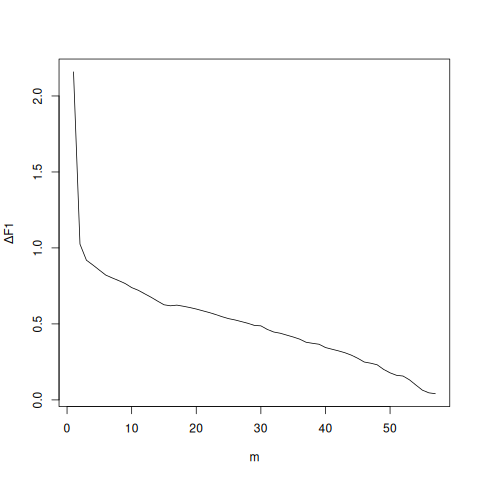
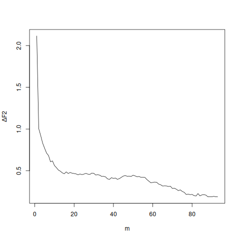

# Application to Pollution Data


## Data Analysis

### Preparation of the Data Set

We describe the results of the test procedure from the package `pscp`.
For a detailed description on how to obtain the data set, see [below](#reproduction-of-results).


The data was obtained from the OpenAQ API and contains measurements of $\mathrm{PM}_{10}$ and
$\mathrm{PM}_{2.5}$.

<details>

<summary>Data Preview</summary>

|  # | date       | id\_6206 | id\_6212 | id\_6983 | ... |
| -: | ---------- | -------: | -------: | -------: | --- |
|  1 | 2016-11-17 |       15 |       23 |       21 | ... |
|  2 | 2016-11-18 |     14.8 |     17.4 |     20.5 | ... |
|  3 | 2016-11-19 |       NA |       NA |     4.59 | ... |
|  4 | 2016-11-20 |       NA |       NA |        2 | ... |
|  5 | 2016-11-21 |     10.8 |      5.8 |      2.9 | ... |
|  6 | 2016-11-22 |     13.6 |     11.6 |        6 | ... |
|  7 | 2016-11-23 |     10.1 |     8.39 |        2 | ... |
|  8 | 2016-11-24 |        7 |       17 |        2 | ... |
|  9 | 2016-11-25 |       15 |     11.3 |     6.33 | ... |
| 10 | 2016-11-26 |       21 |     15.6 |      4.9 | ... |


</details>


The data is measured daily. After reading it into memory (`load_data()`),
it is concatenated, every seventh value is kept and cleaned (`clean_data()`),
such that we are left with `data_pm_weekly`.

```r
data1 <- load_data("raw/pm10_data.csv")
data2 <- load_data("raw/pm25_data.csv")

data_pm <- full_join(data1, data2[, 2:ncol(data2)], by = "date") %>%
  complete(date = seq(min(date), max(date), by = "day"))

data_pm_weekly <- clean_data(data_pm %>% slice(seq(1, n(), by = 7)))
```


### Using pscp to estimate parameters


We load the package `library(pscp)` for data analysis and run its functions
`estimate_changepoint()`, `get_delta_f1()` and `get_delta_f2()`.
Note that the latter two will be run in parallel. To parallelize, make
sure the `future` package (and optionally `progressr` for a progress bar)
is installed.

```r
future::plan(future::multisession, workers = 10)    # use 10 cores
del_f1 <- get_delta_f1(df, parameters$khat, parallelize = TRUE)
del_f2 <- get_delta_f2(df, parameters$khat, parallelize = TRUE)

# visually select m1 and m2
plot(del_f1, type = "l")    # m1 = 15
plot(del_f2, type = "l")    # m2 = 18
```


<details>

<summary>See &#x0394;F<sub>1</sub> and &#x0394;F<sub>2</sub></summary>

|  |  |
|:--:|:--:|
| $\Delta F_1$ | $\Delta F_2$ |

</details>


We have the following properties of the data set.

```r
> print(parameters)
# A tibble: 1 × 6
      n     p  khat khat_date         m1    m2
  <int> <int> <dbl> <chr>          <dbl> <dbl>
1   458  1381   175 March 19, 2020    15    18
```


### Running the tests


With `m = c(m1 = 15, m2 = 18)`, we get the test results by running the following two commands. Not setting the parameter `alpha` defaults it to testing for 5%.

```r
test_n <- cp_test_normalized(df, m = m, parallelize = TRUE)
#        tn  vn khat delta_max n_points m1 m2
# 1 134.308 0.5  175   124.319       20 15 18

test_s <- cp_test_sparsity_adj(df, m = m, parallelize = TRUE)
#         tn    vn khat delta_max n_points m1 m2 shat
# 1 2364.358 46.34  175  1437.819       20 15 18   61
```

We do not have to set the parameter `delta` ($\Delta$). When left blank, we obtain the maximal value for $\Delta$, such that the test still rejects (if this value is positive).
In the second test, the value `shat` represents the size of the estimated set $\hat S_n$.


Taking the square root of `tn`, `vn` and `delta_max` yields better interpretable results for the actual size of the change.

```r
> sqrt(test_n %>% select(tn, vn, delta_max))
#         tn        vn delta_max
# 1 11.58913 0.7071068  11.14984

> sqrt(test_s %>% select(tn, vn, delta_max))
#         tn       vn delta_max
# 1 48.62466 6.807349  37.91858
```


Finally, we can use the result of the tests to obtain one- and two-sided 95% confidence intervals (taking square root again) by (similarly for `test_s`)


```r
> sqrt(ci_sq_norm(test_n))
#    lower    upper 
#  0.00000 11.16154 

> sqrt(ci_sq_norm_twoside(test_n))
#    lower    upper 
# 12.12642 11.02588 
```


## Reproduction of results

### Retrieval of data

For the following, it is required to download the [`openaq` R-package](openaq_github) and to
create an account to obtain an API key. This can be done [here][openaq_register].
Then, set the key in `~/.Renviron` as follows.

```txt
OPENAQ_API_KEY=PASTE_YOUR_API_KEY_HERE
```

[openaq_register]: https://explore.openaq.org/register
[openaq_github]: https://github.com/openaq


Note that by running the file [`download-sensor-info.R`](download-sensor-info.R), the files
`raw/locations.csv` and [`raw/sensors.csv`](raw/sensors.csv) will be downloaded. This repository
includes [`raw/sensors.csv`](raw/sensors.csv), which is sufficient to reproduce the results.
Therefore, it is not needed to run this file.


With an existing [`raw/sensors.csv`](raw/sensors.csv) file, you can run the file
[`download-measurements.R`](download-measurements.R), which is needed to run the data analysis.
This R-script will use the ids from the sensors contained in [`raw/sensors.csv`](raw/sensors.csv)
to download all the available measurements, which will take some time. (Note that the OpenAQ API
is rate limited and therefore a maximum of 60 request per minute can be made).


Once the download has finished, it will have created the files `pm10_data.csv` and
`pm25_data.csv`. Run the script `data-analysis.R` next and you will get the following results.


### Further Explanations

#### download-sensor-data.R


The function `fetch_all_locations()` calls the openAQ API with a box (specified by four pairs of long and lat constituting the range of the box), where we chose the southwestern part of Europe that includes the Iberian Peninsula and most parts of France (see below for a full list of location ids and a corresponding map).

```r
locations <- fetch_all_locations(
  bbox = c(xmin = -9.75, ymin = 36.00, xmax = 5.91, ymax = 48.53)
)
```

Usually, this command runs fast, but fetching the sensor data takes a lot more time,
which is why we included the file `raw/sensors.csv`, which looks as follows.


<details>
<summary>Preview file <code>sensors.csv</code></summary>


|  # |    id | name       | parameters\_id | datetime\_first\_utc | datetime\_first\_local | datetime\_last\_utc | datetime\_last\_local |  min |    max |              avg | expected\_count | expected\_interval | observed\_count | observed\_interval | percent\_complete | percent\_coverage | latest\_value | latest\_datetime    | latest\_latitude | latest\_longitude |
| -: | ----: | ---------- | -------------: | -------------------- | ---------------------- | ------------------- | --------------------- | ---: | -----: | ---------------: | --------------: | ------------------ | --------------: | ------------------ | ----------------: | ----------------: | ------------: | ------------------- | ---------------: | ----------------: |
|  1 | 23692 | pm25 µg/m³ |              2 | 2018-01-07           | 2018-01-07 01:00:00    | 2024-01-29 19:00:00 | 2024-01-29 20:00:00   |    0 |     92 | 6.23126580593638 |               1 | 01:00:00           |           15051 | 15051:00:00        |           1505100 |           1505100 |             9 | 2024-01-29 19:00:00 |  43.309444439464 |       -2.01111111 |
|  2 | 23690 | pm10 µg/m³ |              1 | 2018-01-07           | 2018-01-07 01:00:00    | 2024-01-29 19:00:00 | 2024-01-29 20:00:00   |    0 |    172 | 10.0148014198647 |               1 | 01:00:00           |           14956 | 14956:00:00        |           1495600 |           1495600 |            16 | 2024-01-29 19:00:00 |  43.309444439464 |       -2.01111111 |
|  3 | 15370 | pm10 µg/m³ |              1 | 2017-12-07 01:00:00  | 2017-12-07 02:00:00    | 2019-06-04 03:00:00 | 2019-06-04 05:00:00   |    0 | 7574.6 | 17.0150021978022 |               1 | 01:00:00           |            9100 | 9100:00:00         |            910000 |            910000 |          13.7 | 2019-06-04 03:00:00 |        43.695366 |          3.800817 |
|  4 |  5568 | pm10 µg/m³ |              1 | 2016-11-21 12:00:00  | 2016-11-21 13:00:00    | 2016-11-29 01:00:00 | 2016-11-29 02:00:00   | 1.33 |   20.5 |           9.3725 |               1 | 01:00:00           |               4 | 04:00:00           |               400 |               400 |          20.5 | 2016-11-29 01:00:00 | 45.3895622059041 |  4.61581342439134 |


See the full file: <a href="raw/sensors.csv">raw/sensors.csv</a>


*Contains information from several providers (via OpenAQ).
Licenses and URIs: see [ATTRIBUTION.md](raw/ATTRIBUTION.md) under column 'Provider.'*


</details>


#### download-measurements.R


Using this information, all the measurements can be downlaoded using `fetch_all_sensor_measurements()`.

```r
all_sensor_ids <- read.csv("raw/sensors.csv")$id

for (i in seq_along(all_sensor_ids)) {
    p(message = sprintf("i=%d", i))
    id <- all_sensor_ids[i]
    tryCatch({
      res <- fetch_all_sensor_measurements(id) %>%
        transmute(
          value = value,
          pollutant = parameter_name,
          date = as.Date(datetime_from),
          sensor_id = id
        )
      measures_df <- bind_rows(measures_df, res)
    },
    error = function(e) {
      warning(sprintf("Data of sensor %s not stored: (%s)", id, e$message))
    })
}
```

